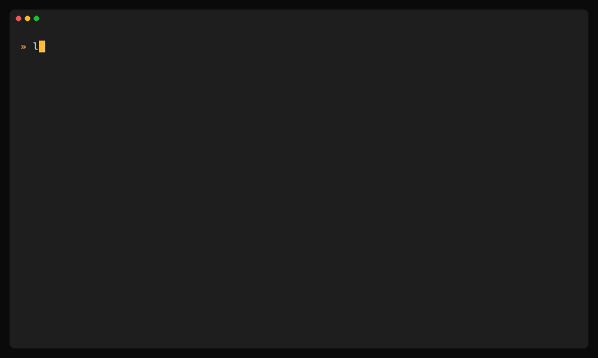

<p align="center">
  
</p>

<h1 align="center">lode</h1>

<p align="center">
  <strong>A package manager for Minecraft modpacks.</strong><br>
  Declare your mods in one file — <code>lode</code> resolves the dependencies, locks them by hash, and installs the jars.
</p>

<p align="center">
  <a href="https://github.com/giovani-freitag/lode/actions/workflows/ci.yml"></a>
  
  &nbsp;·&nbsp;
  
  
  
  
</p>

<p align="center">
  
</p>

---

Think **npm, but for Minecraft mods** — one reproducible pack from **Modrinth** and **CurseForge**, with no clone-and-build and no separate installer.

```sh
lode init                        # scaffold a pack (loader + Minecraft version)
lode add create                  # add a mod, with its dependencies
lode install --server            # set up a server from the lockfile
lode get github.com/you/pack     # fetch someone's published pack, verified
```

## ✨ Features

- 📄 **One manifest, one lockfile** — the same pack, reproducible on every machine.
- 🔗 **Real dependency resolution** — a mod's deps come along, deduplicated; `lode why <mod>` shows what pulled anything in.
- 🔒 **Locked by hash** — every jar pinned to its checksum; `lode verify` catches drift or tampering.
- 🌐 **Modrinth and CurseForge in one pack** — mix both freely, no lock-in.
- 📦 **Installs the loader, not just the mods** — `lode install --server` brings up a ready-to-run server.
- ✍️ **Signed, verifiable releases** — `lode get --verify` proves a pack came from you.
- 🔁 **packwiz bridge** — bring a packwiz pack in with `import`, or `export` back out.

## 📦 Requirements

- **Java** — only to set up a server (`install --server`). `lode` finds it via `JAVA_HOME`/`PATH`; pass `--java <path>` to override. JDK 17 for 1.20.x, 21 for 1.21+ ([Temurin](https://adoptium.net)).
- **CurseForge API key** — only for CurseForge mods. Modrinth works out of the box.

## 🚀 Install

```sh
# Linux / macOS
curl --proto '=https' --tlsv1.2 -LsSf https://github.com/giovani-freitag/lode/releases/latest/download/lode-installer.sh | sh

# Windows (PowerShell)
powershell -c "irm https://github.com/giovani-freitag/lode/releases/latest/download/lode-installer.ps1 | iex"

# Rust users — prebuilt binary, no compile
cargo binstall --git https://github.com/giovani-freitag/lode lode
```

On Windows you can also use a package manager:

```powershell
winget install GiovaniFreitag.lode
scoop bucket add lode https://github.com/giovani-freitag/scoop-lode; scoop install lode
```

Prefer clicking? Grab the **`.msi`** (Windows) or the tarball for your platform from the
[Releases page](https://github.com/giovani-freitag/lode/releases). From source:
`cargo install --git https://github.com/giovani-freitag/lode`.

## 📖 Quick tour

Start a pack, add a couple of mods, and inspect what you've got:

```sh
lode init -y --loader forge --minecraft 1.20.1 --name "My Pack"
lode add create                  # from Modrinth — the default provider
lode add rei                     # Roughly Enough Items; its deps (Architectury, Cloth Config) come along
lode list                        # the resolved pack: direct mods vs. deps, side, provider
lode why cloth-config            # → required by: rei
lode install --server            # provisions Forge/NeoForge, then installs the server-side mods
```

Ship it, and let someone else install the *exact* same pack — verified end to end:

```sh
lode publish --sign --tag v1.0.0   # you
lode get github.com/you/pack --verify   # them
```

The published bundle is **thin** — manifest, lockfile, and overlays, no jars — so sharing stays within each mod's redistribution rules. Details in [docs/signing.md](docs/signing.md).

## 🧭 Commands

| Command | What it does |
|---------|--------------|
| `lode init` | Scaffold a pack (loader + Minecraft version). |
| `lode add <mod>` · `del` | Add / remove a mod — resolves deps, downloads the jars. |
| `lode install` | Set up an instance from the lockfile (`--server` provisions the loader too). |
| `lode get <host/owner/repo>` | Fetch + verify a published pack and set it up. |
| `lode publish` · `bundle` | Publish the pack as a signed release · build the distributable locally. |
| `lode update` · `list` · `why` | Bump versions · inspect the resolved pack and its provenance. |

Full reference, every flag → **[docs/commands.md](docs/commands.md)**.

## 📚 Docs

- **[Command reference](docs/commands.md)** — every command and flag.
- **[Signing & verification](docs/signing.md)** — sign a release; `lode get --verify`.
- **[Roadmap](docs/roadmap.md)** — what's done and what's next.
- **[Releasing](docs/releasing.md)** — how releases are cut (maintainers).

MIT licensed.
